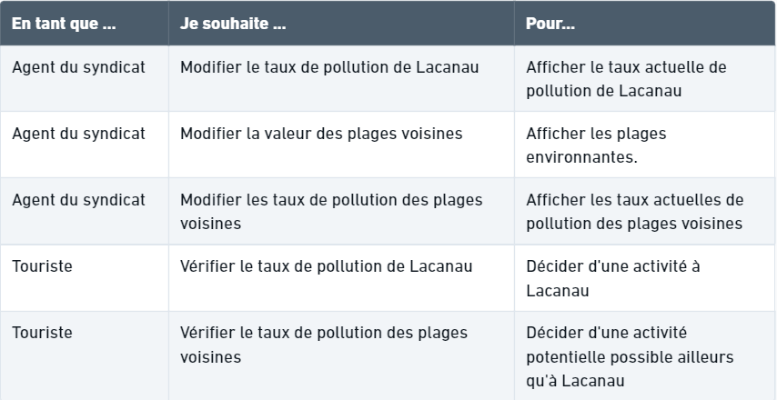
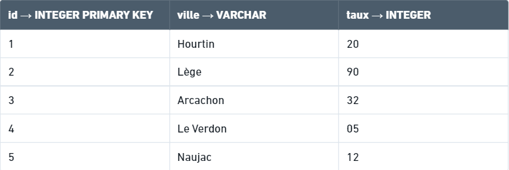

# Pré-étude

### Énoncé

_Je dois créer une interface web mono page qui renvoie l’affichage de qualité des eaux de Lacanau ainsi que des plages voisines._

_Un champ de saisie permet à l’utilisateur d'entrer une valeur de pollution le jour J, une valeur proche de 0 correspondant à une eau polluée tandis qu’une valeur se rapprochant de 100 signifiant une eau propre. Cette valeur entraîne alors l’affichage d’une illustration correspondant au taux de pollution._

_Une partie annexe de la page renvoie elle une liste des plages avoisinantes ainsi que leur taux de pollution d’eau respectif._

### User Stories

### Table

